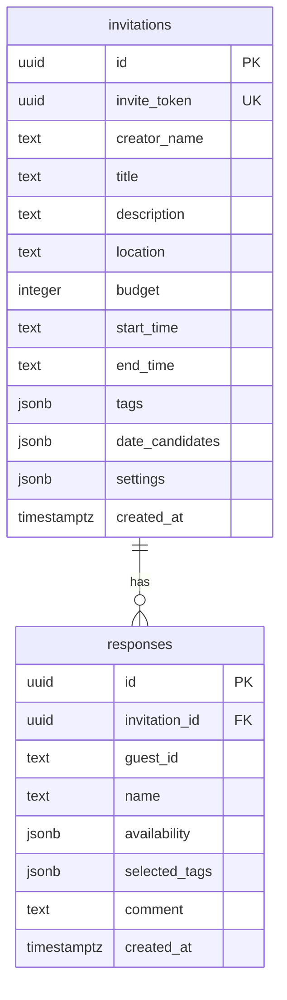

# Quick Plan（日程・イベント調整アプリ）

Quick Plan は、日程調整を起点にイベント作成を支援するアプリです。イベント名と候補日を入力するだけで招待ページを作成し、共有リンクから参加可否、タグ、コメントなどの判断材料を集められます。単なる「○△×」の集計ではなく、主催者が納得感を持ってイベント内容を決められる状態を目指しています。


## アプリ URL

- 本番環境: <https://quick-plan-wine.vercel.app/>

## 目次

- [特徴](#特徴)
- [開発背景](#開発背景)
- [主要ユースケース](#主要ユースケース)
- [プロダクト方針](#プロダクト方針)
- [技術スタック](#技術スタック)
- [アーキテクチャ](#アーキテクチャ)
- [ページ構成とデータフロー](#ページ構成とデータフロー)
- [DB 設計](#db-設計)
- [設計上の留意点](#設計上の留意点)
- [設計上のトレードオフ](#設計上のトレードオフ)
- [ローカル開発](#ローカル開発)
- [将来の追加要素](#将来の追加要素)

## 特徴

- **ログイン不要で日程調整を作成**
  - イベントタイトルと候補日を入力すると、UUID ベースの招待 ID / URL が発行されます。
- **候補日ごとの回答集計**
  - 回答は `yes` / `maybe` / `no` で管理し、候補日別に集計します。
- **概要ダッシュボード**
  - Best Date、回答数、候補日ごとの内訳、回答者一覧、コメントを確認できます。
- **詳細な回答画面**
  - 共有された回答 URL から、名前・参加可否・タグ・コメントを送信できます。
- **匿名回答・コメント可否・回答締切**
  - 招待作成時に、匿名回答、コメント許可、回答締切を設定できます。
- **タグによる判断材料の収集**
  - 「駅近」「予算感」など、イベント決定に必要な条件をタグとして回答に紐づけ、なぜその日程が良い / 難しいのかを把握しやすくします。
- **招待の共有支援**
  - 招待 ID のコピー、Web Share API による共有、QR コード表示に対応しています。
- **最近閲覧した招待の保存**
  - ブラウザの `localStorage` に直近 5 件の閲覧履歴を保持します。
- **レスポンシブ UI**
  - モバイルファーストで作成画面・回答画面・結果画面を利用できます。

## 開発背景

既存の日程調整サービスは、回答が「○ / △ / ×」に集約されるため、最善な日程を選ぶ根拠が不足しがちです。特に「△」の理由が分からない場合、主催者は追加で質問したり、参加者ごとの事情を個別に確認したりする必要があります。結果として、日程を確定する責任と判断負荷が主催者に集中します。

Quick Plan は、この負担を減らすために、参加可否だけでなくタグやコメントも合わせて集める設計にしています。日程ごとの回答状況に加えて「なぜその回答なのか」「どの条件が重要なのか」を見える化し、主催者が納得感のある理由を持ってイベントを決定できる状態を目指しています。

また、イベントでは日程以外にも場所、予算、参加条件、補足事項などの情報が分散しやすくなります。Quick Plan は日程調整アプリでありながら、最終的にはイベントに関連する情報を 1 つの招待ページへ統合する「イベント作成ツール」として発展させることを意識しています。

特に以下を意識しています。

- 主催者がイベント作成と日程決定にかける時間を短くすること
- 回答者がスマートフォンから迷わず回答できること
- 参加可否だけでなく、コメントや条件タグから日程決定に必要な根拠を集められること
- 場所、予算、補足情報など、イベントに関する情報を招待ページへ集約すること
- 認証なしでも最低限安全に使えるよう、DB へのアクセス経路をサーバー側に寄せること

## 主要ユースケース

1. 幹事がトップページから「日程調整を作成」を開く。
2. イベントタイトル、候補日、任意項目（説明、場所、予算、時間、タグ、締切など）を入力する。
3. 作成完了後、招待ページに遷移し、共有ダイアログから回答 URL / 招待 ID / QR コードを共有する。
4. 回答者は回答 URL から参加可否、タグ、コメントを送信する。
5. 幹事は招待ページで候補日ごとの集計、Best Date、コメント、回答者一覧を確認する。

## プロダクト方針

Quick Plan が重視しているのは、単に空いている日を探すことではなく、イベントの意思決定に必要な情報を集めることです。日程はイベント作成の一部であり、タグ、コメント、場所、予算、補足情報を同じ文脈で扱うことで、主催者と参加者の認識をそろえやすくします。

そのため、タグは本アプリの重要な要素です。タグを使うことで、回答者は「参加できる / できない」だけでは表現しにくい条件や理由を短い操作で伝えられます。コメントはタグで表現しきれない事情を補完し、主催者が日程やイベント内容を決める際の根拠として利用できます。

## 技術スタック

| 領域 | 技術 |
| --- | --- |
| フレームワーク | Next.js 16（App Router） |
| UI | React 19、Tailwind CSS 4、Radix UI、shadcn/ui 系コンポーネント |
| 状態管理 | React Hooks、Server Components、Server Actions |
| DB / BaaS | Supabase（PostgreSQL） |
| DB クライアント | `@supabase/supabase-js`、`@supabase/ssr` |
| 日付 UI / 日付処理 | `react-day-picker`、`date-fns` |
| カレンダー | FullCalendar |
| グラフ / 集計表示 | Recharts |
| アイコン | lucide-react |
| 通知 | sonner |
| デプロイ想定 | Vercel |
| 言語 | TypeScript |
| Lint | ESLint |

## アーキテクチャ

```text
Browser
  ├─ /                         トップページ・招待 ID 入力・閲覧履歴
  ├─ /create                   招待作成フォーム
  ├─ /answer/[token]           回答者向け画面
  └─ /invitation/[token]       幹事・参加者向け結果画面
        │
        │ fetch / Server Action / Server Component
        ▼
Next.js App Router
  ├─ app/api/invitation/route.ts        招待作成 API
  ├─ app/answer/[token]/action.ts       回答 upsert Server Action
  └─ app/invitation/[token]/actions.ts  招待・回答取得処理
        │
        │ supabaseService()（Service Role Key）
        ▼
Supabase PostgreSQL
  ├─ invitations
  └─ responses
```

### レイヤー構成

- **Client Components**
  - フォーム入力、カレンダー操作、共有ダイアログ、トースト通知、`localStorage` など、ブラウザ API が必要な処理を担当します。
- **Server Components**
  - 招待ページ・回答ページの初期データ取得を担当します。
- **Route Handler**
  - `/api/invitation` で招待作成を受け付け、DB に保存します。
- **Server Actions**
  - 回答送信時に `responses` テーブルへ upsert し、関連ページを revalidate します。
- **Supabase Service Client**
  - DB 操作はサーバー側の `SUPABASE_SERVICE_ROLE_KEY` を使って実行します。クライアント側から直接 DB を操作しない設計です。

## ページ構成とデータフロー

### `/`

- 招待 ID（UUID 形式）を入力して `/invitation/[token]` に移動します。
- `localStorage` から最近閲覧した招待を読み込みます。

### `/create`

- `InvitationDraft` 型に沿って招待情報を作成します。
- 候補日は送信前に日付順へソートされます。
- `POST /api/invitation` に送信し、作成後は `/invitation/[inviteToken]?share=1` へ遷移します。

### `POST /api/invitation`

- 必須項目は `title` と 1 件以上の `dateCandidates` です。
- `crypto.randomUUID()` で `invite_token` を発行し、`invitations` に保存します。

### `/answer/[token]`

- `invite_token` から招待を取得します。
- 締切が過ぎている場合は回答不可状態として扱います。
- 回答者の `guest_id` はブラウザの `localStorage` に保存し、同じ端末からの再回答は同一回答として upsert し、回答が編集されます。

### `/invitation/[token]`

- 招待と回答一覧を取得します。
- 候補日ごとに `yes` / `maybe` / `no` の件数、タグ集計、回答者、コメントを集計します。
- `yes + maybe * 0.6 - no * 0.8` のスコアで Best Date 候補を算出します。

## DB 設計

現行実装で利用しているテーブルは `invitations` と `responses` の 2 つです。候補日、タグ、設定、回答内容は JSONB として保持し、日程調整 1 件あたりの読み取りを少ないクエリで完結させる設計です。

### ER 図



### `invitations`

| カラム | 型 | 用途 |
| --- | --- | --- |
| `id` | `uuid` | 招待の内部 ID。主キー。 |
| `invite_token` | `uuid` | URL 共有用トークン。`/invitation/[token]` と `/answer/[token]` で利用。一意かつ必須。 |
| `creator_name` | `text` | 幹事名。必須。 |
| `title` | `text` | イベントタイトル。必須。 |
| `description` | `text` | イベント説明。任意。 |
| `location` | `text` | 開催場所。任意。 |
| `budget` | `integer` | 予算。任意。 |
| `start_time` | `text` | イベント全体の開始時刻。任意。 |
| `end_time` | `text` | イベント全体の終了時刻。任意。 |
| `tags` | `jsonb` | イベントに紐づくタグ配列。任意。 |
| `date_candidates` | `jsonb` | 候補日配列。各日程につき、開始時刻、終了時刻、コメントを設定可能。必須。 |
| `settings` | `jsonb` | 匿名回答、コメント可否、回答締切などの設定。必須。 |
| `created_at` | `timestamptz` | 作成日時。 |

#### `date_candidates` の例

```json
[
  {
    "id": "candidate-id",
    "date": "2026-05-16T00:00:00.000Z",
    "startTime": "9:00",
    "endTime": "12:00",
    "comment": "土曜日なので午前から"
  }
]
```

#### `settings` の例

```json
{
  "anonymousResponse": false,
  "allowComments": true,
  "deadline": "2026-05-20T00:00:00.000Z"
}
```

### `responses`

| カラム | 型 | 用途 |
| --- | --- | --- |
| `id` | `uuid` | 回答の内部 ID。主キー。 |
| `invitation_id` | `uuid` | `invitations.id` への外部キー。招待削除時はcascadeで削除されます。 |
| `guest_id` | `text` | 回答者端末に保存した識別子。同じ招待内の再回答判定に利用。必須。 |
| `name` | `text` | 回答者名。匿名設定時は表示側でマスク。 |
| `availability` | `jsonb` | 候補日ごとの `yes` / `maybe` / `no` とバッジ。必須。 |
| `selected_tags` | `jsonb` | 回答者が選択したタグ。任意。 |
| `comment` | `text` | 回答コメント。 |
| `created_at` | `timestamptz` | 回答日時。 |

#### `availability` の例

```json
[
  {
    "candidateId": "candidate-id",
    "status": "maybe",
    "badges": [
      { "id": "tag-id", "label": "3000円以内なら" }
    ]
  }
]
```

### Supabse SQL

現在の Supabase スキーマは以下です。`responses` は `unique(invitation_id, guest_id)` により同じ端末からの再回答を upsert できるようにしています。

```sql
create table invitations (
  id uuid primary key default gen_random_uuid(),
  invite_token text unique not null,

  creator_name text not null,
  title text not null,
  description text,
  location text,
  budget integer,
  start_time text,
  end_time text,

  tags jsonb,
  date_candidates jsonb not null,
  settings jsonb not null,

  created_at timestamptz default now()
);

create table responses (
  id uuid primary key default gen_random_uuid(),

  invitation_id uuid not null references invitations(id) on delete cascade,

  guest_id text not null,

  name text,
  availability jsonb not null,
  selected_tags jsonb,
  comment text,

  created_at timestamptz default now(),

  unique(invitation_id, guest_id)
);

DO $$
BEGIN
  IF to_regclass('public.invitations') IS NOT NULL THEN
    ALTER TABLE public.invitations ENABLE ROW LEVEL SECURITY;
  END IF;
  IF to_regclass('public.responses') IS NOT NULL THEN
    ALTER TABLE public.responses ENABLE ROW LEVEL SECURITY;
  END IF;
END $$;
```

### RLS（Row Level Security）

上記SQLでは、`invitations` と `responses` の RLS を有効化しています。

## 設計上の留意点

### 1. 認証なし利用と安全性のバランス

ログイン不要の手軽さを優先しつつ、DB への直接アクセスは公開せず、Route Handler / Server Action / Server Component 経由に集約しています。Service Role Key はサーバー環境変数としてのみ利用します。

### 2. 招待トークンの扱い

招待 URL は UUID 形式の `invite_token` を利用します。トップページの手入力導線でも UUID 形式を検証し、不正な形式の場合は遷移しません。

### 3. 回答の冪等性

回答者ごとに `guest_id` を発行し、`invitation_id`, `guest_id` をキーに upsert します。これにより、同じ端末から回答を修正しても回答行が増え続けないようにしています。

### 4. JSONB の採用

候補日、タグ、設定、回答内容はイベントごとに構造がまとまっており、現段階では高度な横断検索よりも読み書きの単純さを重視して JSONB で保持しています。将来的に分析や詳細検索が必要になった場合は、候補日や回答詳細を正規化する余地があります。

### 5. 匿名回答の表示制御

匿名回答の場合も DB には回答者名を保存できますが、結果画面では設定に応じて表示名を `参加者N` に置き換えます。将来的にプライバシー要件を強める場合は、匿名時に名前を保存しない設計へ変更できます。

### 6. 締切判定

回答締切は `settings.deadline` に ISO 文字列で保存し、回答画面・結果画面で現在時刻と比較します。タイムゾーン表示や日付のみ締切の扱いは、今後の改善余地があります。

### 7. 外部 QR コード API

共有ダイアログの QR コードは外部 API（`api.qrserver.com`）で生成しています。ネットワーク制限や可用性を重視する場合は、アプリ内で QR コードを生成するライブラリへの置き換えをする必要があります。

## 設計上のトレードオフ

### ログインを必須にするか

現時点では、初期利用のハードルを下げるためにログイン不要で使える設計にしています。リンクを作って共有するだけで使えるため、初回ユーザーや小規模なイベントでは導入しやすくなります。

一方で、ログインを必須にしない場合、ユーザーアカウントに紐づく継続的な体験は作りにくくなります。例えば、同じグループで再度イベントを作成する、過去のイベントを一覧化する、未回答者へ通知する、回答催促を送るといった機能は実装しづらくなります。将来的に継続利用や通知を重視する場合は、任意ログインや主催者のみログインなどの段階的な導入を検討します。

### 作成時の入力欄をどこまで増やすか

場所、予算、タグ、コメント、締切などの入力欄を増やすほど、招待カードとしての情報量やカスタマイズ性は高まります。しかし、作成時の心理的負担も大きくなり、「とりあえず作る」体験が損なわれる可能性があります。

そのため、イベントタイトルと候補日を中心にしつつ、その他の情報は任意入力にしています。必要な人は詳細に作り込める一方で、最小限の入力でも共有まで進められるバランスを目指しています。

## ローカル開発

### 前提

- Node.js 20 系以上
- npm
- Supabase プロジェクト

### セットアップ

```bash
npm install
```

`.env.local` を作成し、Supabase の接続情報を設定します。

```env
NEXT_PUBLIC_SUPABASE_URL="https://xxxxx.supabase.co"
SUPABASE_SERVICE_ROLE_KEY="your-service-role-key"
```

> `SUPABASE_SERVICE_ROLE_KEY` はブラウザへ公開されるコードに含めてはいけない。

### 開発サーバー

```bash
npm run dev
```

<http://localhost:3000> を開きます。

### Lint

```bash
npm run lint
```

### 本番ビルド

```bash
npm run build
```

## 将来の追加・変更要素(案)

### 体験・UI の改善

- **本番レベルの UI ブラッシュアップ**
  - 招待ページ、回答ページ、結果ページをより見やすく、信頼感のあるデザインにする。
- **LP やティップスの充実**
  - 初めて使う人に向けて、作成方法、回答方法、タグの使い方、イベント確定までの流れを説明する。
- **進捗バーの表示**
  - イベント確定までに必要な入力や確認事項を可視化し、主催者の心理的負担を減らす。
- **招待カード UI とプレビュー**
  - 共有前に招待カードの見え方を確認できるようにし、イベントの雰囲気や必要情報が伝わる UI にする。

### イベント作成機能の拡張

- **場所の投票**
  - イベント発案時点では場所が決まっていないことも多いため、日程だけでなく候補場所も投票できるようにする。
- **タグの充実**
  - 現状のタグ候補は限定的なため、イベント種別や判断軸に応じたタグを増やし、より詳細な回答を集められるようにする。
- **割り勘機能**
  - イベント後に発生しやすい精算まで一括で扱い、イベント作成から終了後のやり取りまで統合する。
- **招待編集・候補日の追加削除**
  - パスワードベースで行う、作成後にタイトル、候補日、締切、説明を変更できる機能。
- **回答編集 UI の強化**
  - 前回入力値の復元による既存回答の読み込み。
### 判断支援・自動化

- **AI による日程評価**
  - 各日程の回答状況、タグ、コメントからスコアや評価理由を算出し、日程を確定する理由や避けるべき理由を生成する。
  **通知機能**
  - 締切前リマインド、回答追加時の通知、未回答者への催促、決定日のお知らせ。ログインや連絡先管理との兼ね合いで検討する。
- **カレンダー連携**
  - Google Calendarへの予定追加。

### 技術・運用改善

- **認証機能**
  - 幹事用ログイン、作成した招待一覧、編集・削除権限の管理。同じグループでのイベント再作成にもつなげる。
- **QR コード生成の内製化**
  - 外部 API 依存をなくす。
- **DB 正規化**
  - 候補日・回答詳細を別テーブル化し、集計性能を高める。
- **アクセシビリティ改善**
  - キーボード操作、スクリーンリーダー対応、色コントラストの改善。PC用UIの改善。
- **テスト拡充**
  - Unit Test、E2E Test、DB 制約のテストを追加。

## ライセンス

現時点では未設定です。